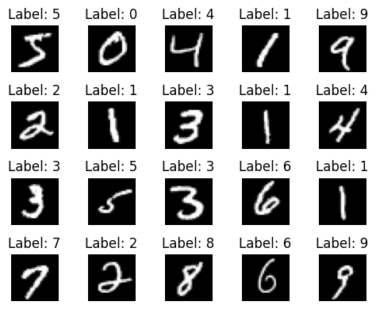
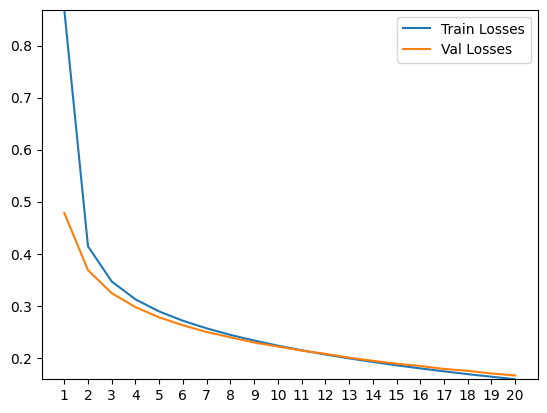
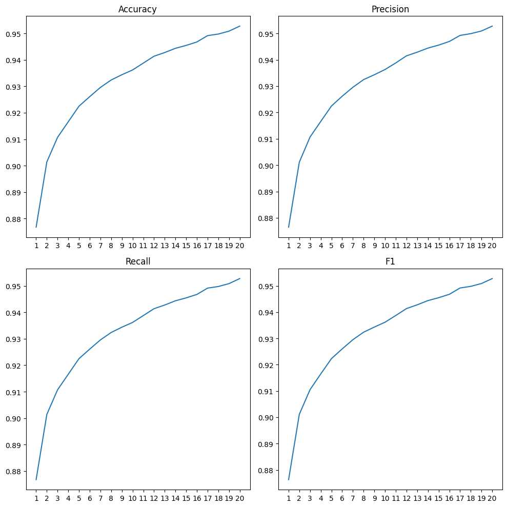
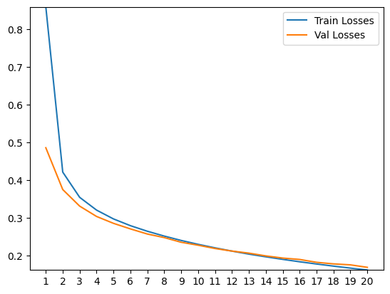
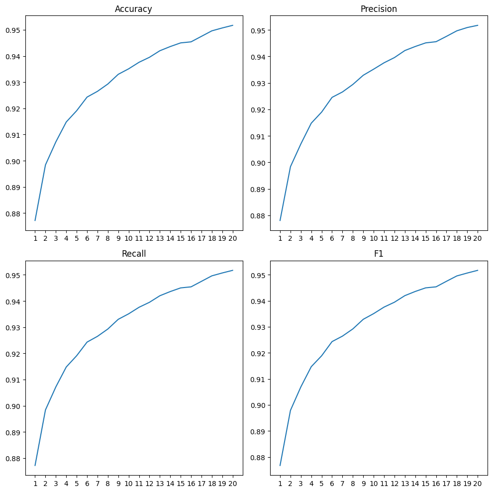
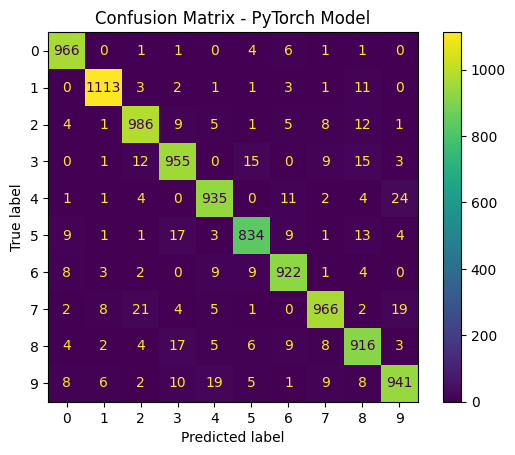
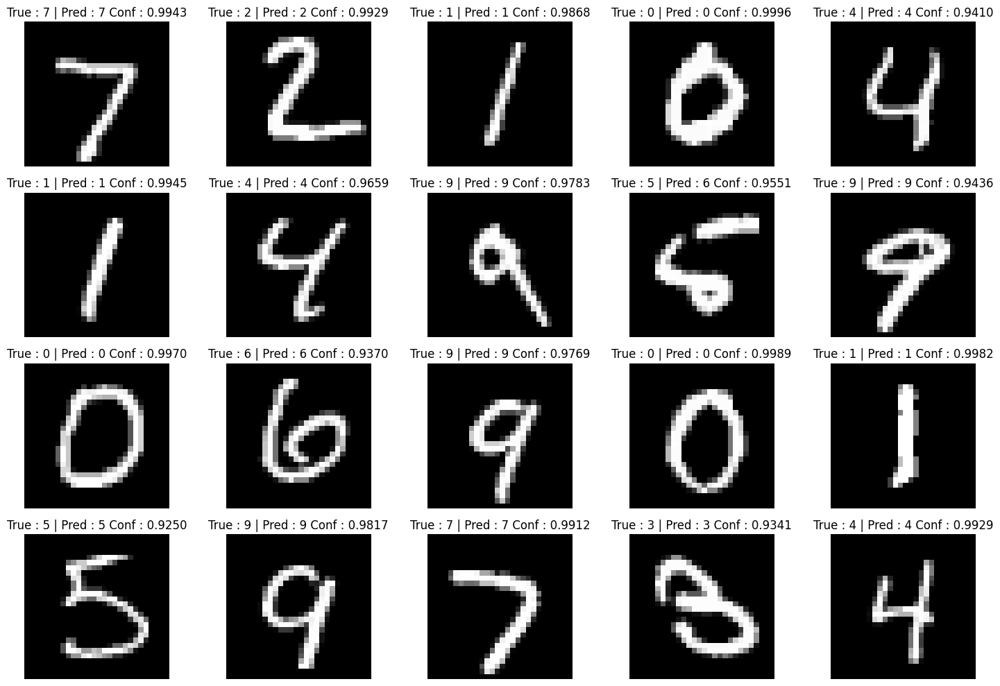
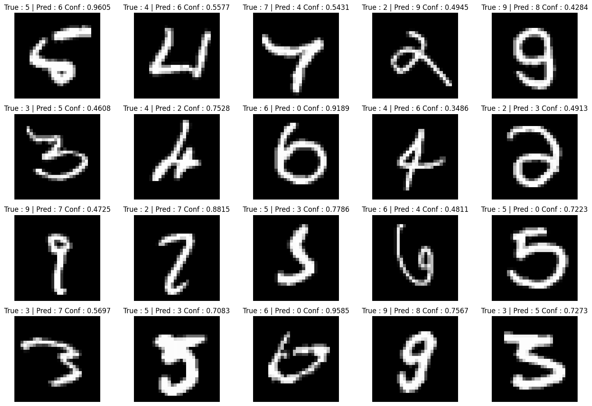

# Neural Network From Scratch


[](https://colab.research.google.com/)


A comprehensive implementation and comparison of a neural network built from scratch using NumPy versus PyTorch on the MNIST digit classification dataset.

## 📋 Table of Contents
- [Overview](#-overview)
- [Features](#-features)
- [Dataset](#-dataset)
- [Model Architecture](#-model-architecture)
- [Usage](#-usage)
- [Results](#-results)
- [Key Insights](#-key-insights)
- [Contributing](#-contributing)
- [Future Enhancements](#-future-enhancements)
- [Author](#-author)

## 🎯 Overview

This project demonstrates the fundamentals of neural networks by building one completely from scratch using only NumPy. By implementing every component manually—from forward propagation to backpropagation—this project provides deep insights into how neural networks actually work under the hood. The manual implementation is then compared against an identical PyTorch model to highlight the differences in performance, training time, and ease of implementation.

**Educational Goals:**
- Understand the mathematics behind neural networks
- Implement core components: activation functions, loss functions, gradient descent
- Learn the importance of proper weight initialization
- Compare manual implementation with modern ML frameworks

## ✨ Features

### NumPy Implementation
- **Custom Neural Network Class** with configurable architecture
- **Activation Functions**: ReLU for hidden layers, Softmax for output layer
- **Loss Function**: Categorical Cross-Entropy
- **Optimization**: Mini-batch Gradient Descent
- **Weight Initialization**: He Initialization for ReLU activation
- **Metrics Tracking**: Accuracy, Precision, Recall, F1-Score
- **Visualization Tools**: Loss curves, confusion matrices, prediction displays

### PyTorch Implementation
- Equivalent architecture using `nn.Sequential`
- Identical hyperparameters for fair comparison
- GPU acceleration support (CUDA)
- Built-in autograd for automatic differentiation

### Additional Features
- Train/Validation/Test split for proper model evaluation
- Mini-batch processing for efficient training
- Data normalization and preprocessing
- Comprehensive visualization of results
- Performance metrics comparison

## 📊 Dataset

**MNIST (Modified National Institute of Standards and Technology)**

The MNIST database is a large collection of handwritten digits commonly used for training image processing systems.

- **Training Samples**: 50,000 (after split)
- **Validation Samples**: 10,000
- **Test Samples**: 10,000
- **Image Dimensions**: 28×28 pixels (grayscale)
- **Classes**: 10 (digits 0-9)
- **Preprocessing**: Normalized to [0, 1] range

### Sample Images


*Sample images from the MNIST dataset with their corresponding labels*

## 🏗️ Model Architecture

### Network Structure

```
Input Layer:        784 neurons (28×28 flattened)
                     ↓
Hidden Layer:       533 neurons (ReLU activation)
                     ↓
Output Layer:       10 neurons (Softmax activation)
```

**Hidden Layer Size Calculation:**  
Following the rule of thumb: `hidden_size = (2/3 × input_size) + output_size`  
`hidden_size = (2/3 × 784) + 10 ≈ 533 neurons`

### Mathematical Components

#### 1. ReLU Activation
```
ReLU(x) = max(0, x)
dReLU(x)/dx = 1 if x > 0, else 0
```

#### 2. Softmax Activation
```
Softmax(x_i) = exp(x_i) / Σ(exp(x_j))
```

#### 3. Categorical Cross-Entropy Loss
```
L = -Σ(y_true × log(y_pred))
```

#### 4. Backpropagation
The gradient computation follows the chain rule:
- **Output Layer**: `dL/dz2 = predictions - true_labels` (simplified due to Softmax + Cross-Entropy)
- **Hidden Layer**: Gradients propagated through ReLU derivative
- **Weight Updates**: `W = W - learning_rate × dL/dW`

### Hyperparameters

| Parameter | Value | Description |
|-----------|-------|-------------|
| Learning Rate | 0.01 | Step size for gradient descent |
| Batch Size | 64 | Samples per mini-batch |
| Epochs | 20 | Training iterations |
| Weight Init | He Initialization | Optimized for ReLU |

## 💻 Usage

See the [full notebook](notebooks/Neural_Network_From_Scratch.ipynb) for the complete analysis

## 📈 Results

### Performance Comparison

| Metric | NumPy Model | PyTorch Model |
|--------|-------------|---------------|
| **Accuracy** | 0.9528 | 0.9534 |
| **Precision** | 0.9528 | 0.9534 |
| **Recall** | 0.9528 | 0.9534 |
| **F1-Score** | 0.9527 | 0.9534 |
| **Training Time** | 2m 52s | 1m 16s |

### Training Curves

#### NumPy Model

*Training and validation loss curves for the NumPy implementation*


*Performance metrics over training epochs*

#### PyTorch Model

*Training and validation loss curves for the PyTorch implementation*


*Performance metrics over training epochs*

### Confusion Matrices

#### NumPy Model

*Confusion Matrix for the NumPy implementation*

#### PyTorch Model

*Confusion Matrix for the PyTorch implementation*

### Prediction Examples

#### NumPy Model

##### Correct Classifications

*Sample of correctly classified digits with confidence scores for the NumPy model*

##### Incorrect Classifications

*Sample of misclassified digits for the NumPy model*

#### PyTorch Model

##### Correct Classifications

*Sample of correctly classified digits with confidence scores for the PyTorch model*

##### Incorrect Classifications

*Sample of misclassified digits for the PyTorch model*

**Observations:**
- Total incorrect predictions: 447 (NumPy) vs 466 (PyTorch)
- Digits with circular shapes (0, 6, 8, 9) are more prone to misclassification
- Digits with unique shapes (1, 7) have higher accuracy
- Model confidence is generally lower for incorrect predictions

## 🔑 Key Insights

### Technical Learnings

1. **Manual Implementation Complexity**
   - Building a neural network from scratch provides deep understanding of the mathematics
   - Requires careful attention to matrix dimensions and gradient computations
   - Chain rule implementation is critical for backpropagation

2. **Activation Functions**
   - ReLU helps mitigate vanishing gradient problem in hidden layers
   - Softmax ensures output probabilities sum to 1 for classification
   - Different functions serve different purposes in the network

3. **Weight Initialization**
   - He Initialization works best with ReLU activation
   - Proper initialization significantly affects convergence speed
   - Random initialization can lead to slow or unstable training

4. **Mini-Batch Processing**
   - More efficient than single-sample updates due to vectorization
   - Provides more stable gradient estimates than full-batch
   - Balance between computational efficiency and gradient accuracy

5. **Framework Comparison**
   - PyTorch trains faster than NumPy implementation even for a small model
   - Built-in autograd eliminates manual gradient computation
   - Modern frameworks are highly optimized for performance

### Practical Insights

- **Data Preprocessing**: Normalizing pixel values [0, 255] → [0, 1] significantly improves convergence
- **Validation Split**: Essential for monitoring overfitting and model generalization
- **Shuffling**: Prevents order bias in mini-batch gradient descent
- **Hyperparameters**: Learning rate, batch size, and epochs directly impact convergence
- **Softmax + Cross-Entropy**: Combined derivative simplifies backpropagation math

## 🤝 Contributing

Contributions are welcome! Here are some ways you can contribute:

- 🐛 Report bugs and issues
- 💡 Suggest new features or improvements
- 📖 Improve documentation
- 🔧 Submit pull requests

## 🚀 Future Enhancements

### Planned Improvements

- [ ] **Additional Architectures**
  - [ ] Implement multiple hidden layers (deep neural network)
  - [ ] Add dropout layers for regularization
  - [ ] Experiment with different activation functions (Leaky ReLU, ELU, GELU)

- [ ] **Optimization Techniques**
  - [ ] Implement momentum-based optimizers (SGD with momentum, Adam, RMSprop)
  - [ ] Add learning rate scheduling (decay, warm-up, cyclic)
  - [ ] Implement batch normalization

- [ ] **Regularization Methods**
  - [ ] L1/L2 weight regularization
  - [ ] Early stopping mechanism
  - [ ] Data augmentation (rotation, shifting, scaling)

- [ ] **Advanced Features**
  - [ ] Transfer learning with pre-trained models
  - [ ] Model checkpointing and loading

- [ ] **Performance Optimization**
  - [ ] Numba/JIT compilation for NumPy model
  - [ ] Multi-GPU support for PyTorch
  - [ ] Mixed precision training

- [ ] **Visualization & Analysis**
  - [ ] Interactive training dashboard
  - [ ] Feature map visualization
  - [ ] Gradient flow analysis
  - [ ] Learning rate finder

- [ ] **Extended Datasets**
  - [ ] Fashion-MNIST for clothing classification
  - [ ] CIFAR-10 for color image classification
  - [ ] Custom dataset support

### Community Contributions Welcome!

If you'd like to work on any of these enhancements or have your own ideas, please open an issue or submit a pull request!

## 👤 Author

**Umut Bekdemir**

- GitHub: [@DoubleCyclone](https://github.com/DoubleCyclone)
- LinkedIn: [Umut Bekdemir](https://www.linkedin.com/in/umut-bekdemir-803a2825a)
- Email: [umut.bekdemir29@gmail.com](mailto:umut.bekdemir29@gmail.com)

---
